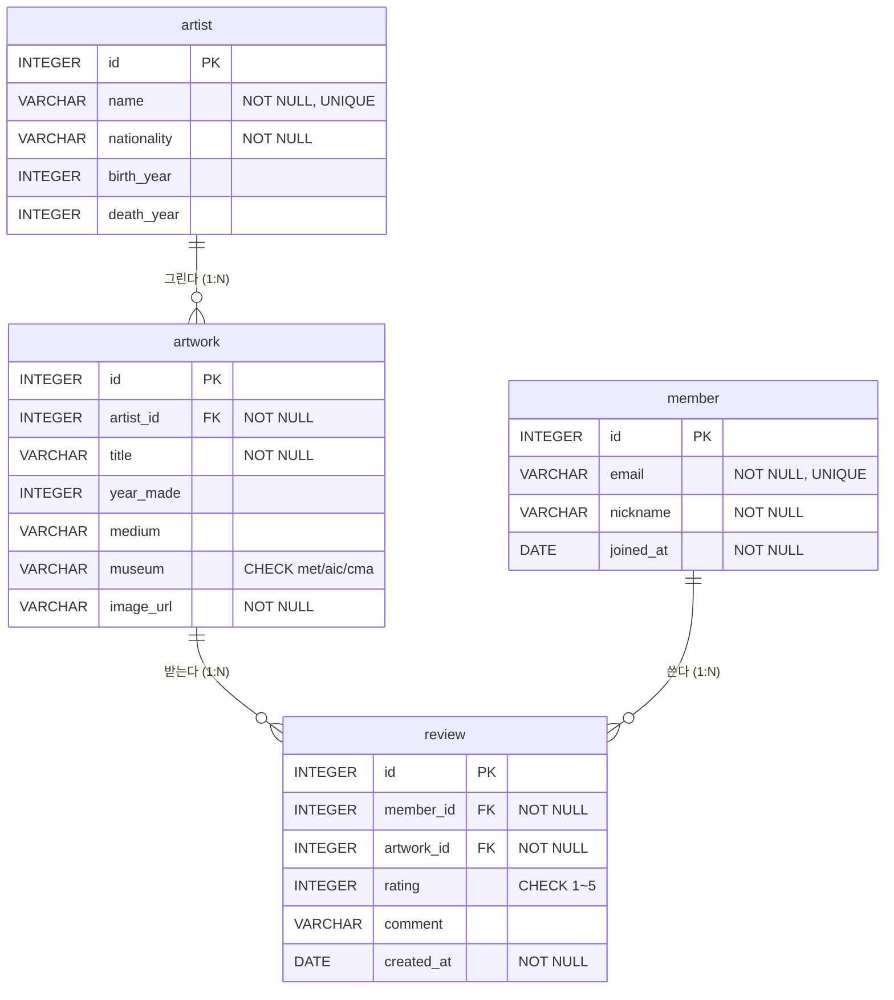

# 3번 풀이 — 명화 감상 리뷰 서랍장 (SQLite)

미술관 CC0 명화 데이터에 **회원**과 **리뷰**를 붙인 데이터베이스입니다.
화가·작품 데이터는 [AITOOLLEARN-7-1](https://github.com/KANGSIK-SEO/AITOOLLEARN-7-1)의 `data/art.db`(MET·AIC·CMA Open Access, CC0)에서 골라 옮겼고, 회원·리뷰는 연습용 가상 데이터입니다.

> 처음 공부한다면 👉 [해설.md](해설.md)부터 읽으세요. 쉬운 설명과 예상 질문이 있어요.

## 제출물

| 요구 제출물 | 파일 |
|---|---|
| 스키마 생성 SQL | [schema.sql](schema.sql) |
| 샘플 데이터 INSERT SQL | [data.sql](data.sql) |
| 핵심 쿼리 15개 SQL | [queries.sql](queries.sql) |
| 실행 결과 폴더 | [results/](results/) (한 번에 보기: [results/README.md](results/README.md)) |
| ERD | 아래 다이어그램 |
| (보너스) JOIN vs 서브쿼리 / FK 에러 / 미니 리포트 | [bonus.sql](bonus.sql) → results/B01~B09 |

## ERD



| 표 | 행 수 | 설명 |
|---|---|---|
| artist | 12 | 화가 (렘브란트, 페르메이르, 모네, 고흐 …) |
| artwork | 48 | 작품 (화가마다 4점) |
| member | 12 | 회원 (1명은 리뷰 없음) |
| review | 40 | 리뷰 (별점 1~5) |

## 실행 방법

**방법 1 — 파이썬 (설치할 것 없음)**
```bash
cd 03-sql-digital-drawer/solution
python run.py
```
`art_review.db`를 새로 만들고 쿼리를 모두 실행한 뒤 결과를 `results/`에 저장합니다.

**방법 2 — DB Browser for SQLite / DBeaver 같은 프로그램**
1. 새 SQLite DB를 만든다
2. `schema.sql` → `data.sql` → `queries.sql` → `bonus.sql` 순서로 열어서 실행한다

**방법 3 — sqlite3 명령어**
```bash
sqlite3 art_review.db < schema.sql
sqlite3 art_review.db < data.sql
sqlite3 -header -column art_review.db < queries.sql
```

## 요구사항 확인표

| 요구사항 | 어디서 |
|---|---|
| 표 4개 이상, 모두 PK | artist, artwork, member, review |
| FK 1:N 관계 2개 이상 | 3개: artwork→artist, review→member, review→artwork |
| NOT NULL / UNIQUE | `artist.name`, `member.email` 등 |
| FK가 실제로 막는지 | B03, B04 (`FOREIGN KEY constraint failed`) |
| 각 표 10행 이상 | 12 / 48 / 12 / 40 |
| 기본 조회 4개 (WHERE, ORDER BY, LIMIT) | Q01~Q04 |
| 조인 4개 (INNER 2+, LEFT 1+) | Q05~Q07 INNER, Q08 LEFT |
| 집계 3개 (COUNT/SUM/AVG + GROUP BY) | Q09 COUNT, Q10 AVG, Q11 SUM |
| 서브쿼리 1개 | Q12 |
| UPDATE / DELETE | Q13, Q14 |
| 인덱스 + 이유 | Q15 |

## SQLite 전용 문법 (표준 SQL과 다른 곳)
- `PRAGMA foreign_keys = ON;` — SQLite는 FK 검사가 기본으로 꺼져 있어서 켜야 한다.
- `EXPLAIN QUERY PLAN` — 쿼리를 어떻게 실행할지 보여준다 (MySQL/PostgreSQL은 `EXPLAIN`).
- `substr(created_at, 1, 7)` — 날짜에서 연-월만 뽑는다 (bonus.sql B07).
